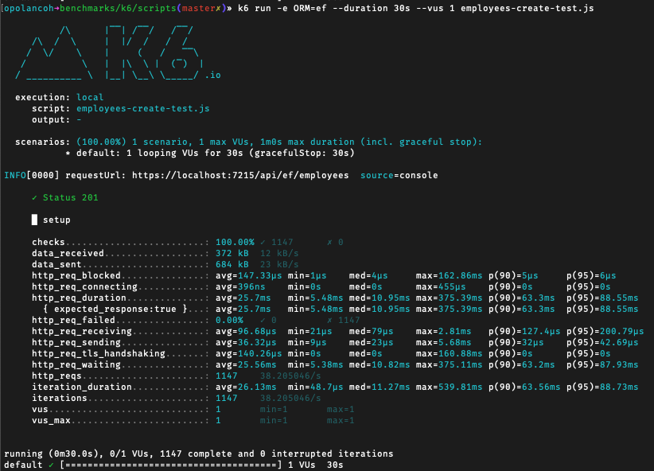
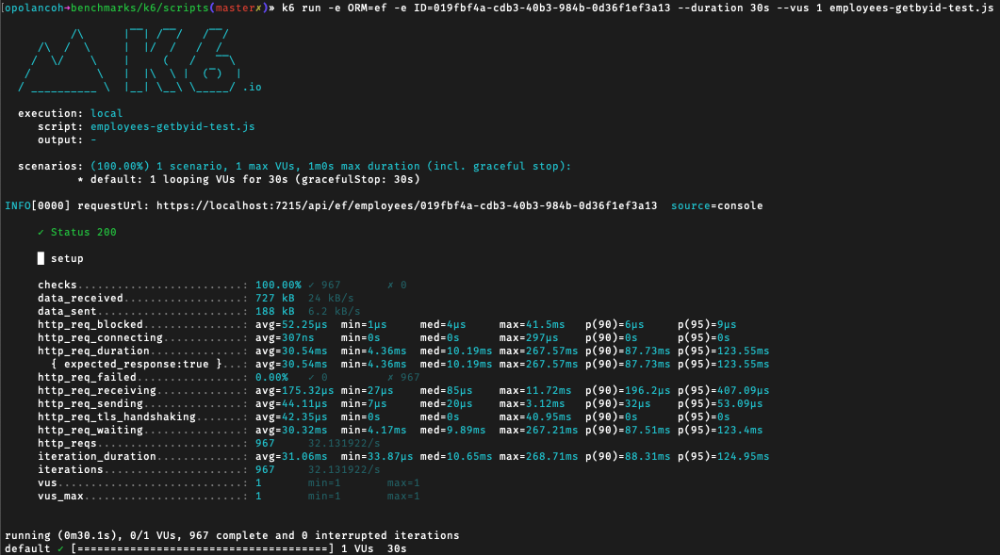

# DotNet ORM Comparison - Query Performance Benchmarking
A .NET Web API to compare EF and Dapper query performance.

[Entity Framework (EF) Core](https://learn.microsoft.com/en-us/ef/core) is an open-source, modern object-relation mapper that lets you build a clean, portable, and high-level data access layer with .NET (C#) across a variety of databases.

[Dapper](https://www.learndapper.com) is an open-source, lightweight Object-Relational Mapping (ORM) library for .NET. It is developed by Stack Overflow and is used to handle data access in applications. Dapper falls into a family of tools known as micro-ORMs.

### Technologies in this repo:
* DotNet 7
* Entity Framework Core 7
* Dapper 2
* k6 (performance testing)
* Postgres

## Database Schema
<p align="center">
  
</p>

## Performance Testing Analysis

### Benchmarking Strategy
Our approach towards this analytical journey is methodical, focusing on one CRUD operation at a time. Each Create, and Read operation will be subjected to a rigorous 30-second performance test. The objective is to ascertain the maximum number of requests that can be effectively handled within these parameters and to meticulously analyze the resulting data.
<!---
Our approach towards this analytical journey is methodical, focusing on one CRUD operation at a time. Each Create, Read, and Update operation will be subjected to a rigorous 30-second performance test, while the Delete operation will be examined across 500 iterations. The objective is to ascertain the maximum number of requests that can be effectively handled within these parameters and to meticulously analyze the resulting data.
-->

### Testing Parameters
Duration: Create, Read: 30 seconds each.
Users: 1
Goal: Analyze the benchmarking results to understand performance under stress.

### Tests

- Average (ms): On average, an HTTP request takes x milliseconds to be fully processed, from initiating the request to processing the received response.
- Median (ms): When all measured values are sorted in order, the median is the value that separates the higher half from the lower half of the data sample.
- P(90) (ms): It implies that 90% of the observed values are less than or equal to x milliseconds, and the remaining 10% are above this value.

#### **Test #1: CREATE (http post)**

**Results (http_req_duration)**:

| ORM       | http_reqs | avg     | min    | med    | max      | p(90)   | p(95)   |
|-----------|-----------|---------|--------|--------|----------|---------|---------|
| `EF Core` | 1456      | 20.28ms | 5.34ms | 9.48ms | 239.79ms | 43.61ms | 75.39ms |
| `Dapper`  | 1964      | 14.96ms | 3.31ms | 7.6ms  | 264.09ms | 34.27ms | 56.17ms |

* 30 seconds
* 1 user
* Insertions: Dapper inserted 508 more rows than EF Core
* Average: Dapper is 1.4x faster than EF Core

**EF Core**
```sh
k6 run -e ORM=ef --duration 30s --vus 1 employees-create-test.js
```
<p align="center">
  
</p>

**Dapper**
```sh
k6 run -e ORM=dapper --duration 30s --vus 1 employees-create-test.js
```
<p align="center">
  
</p>


#### **Test #2: GET ALL (http get)**

**Results (http_req_duration)**:

| ORM       | http_reqs | avg     | min    | med     | max      | p(90)   | p(95)   |
|-----------|-----------|---------|--------|---------|----------|---------|---------|
| `EF Core` | 1262      | 23.1ms  | 4.03ms | 8.78ms  | 250.15ms | 59.76ms | 96.62ms |
| `Dapper`  | 1596      | 18.16ms | 1.72ms | 4.19ms  | 210.18ms | 56.28ms | 81.25ms |

* 30 seconds
* 1 user
* Reads: Dapper fetched 334 more rows than EF Core
* Average: Dapper is 1.3x faster than EF Core

**EF Core**
```sh
k6 run -e ORM=ef --duration 30s --vus 1 employees-getall-test.js
```
<p align="center">
  
</p>

**Dapper**
```sh
k6 run -e ORM=dapper --duration 30s --vus 1 employees-getall-test.js
```
<p align="center">
  
</p>


#### **Test #3: GET BY ID (http get)**

**Results (http_req_duration)**:

| ORM       | http_reqs | avg     | min     | med     | max       | p(90)   | p(95)    |
|-----------|-----------|---------|---------|---------|-----------|---------|----------|
| `EF Core` | 1148      | 25.74ms | 4.07ms  | 9.61ms  | 292.58ms  | 76.94ms | 98.12ms  |
| `Dapper`  | 608       | 48.98ms | 1.85ms  | 34.77ms | 205.8ms   | 109.1ms | 130.27ms |

* 30 seconds
* 1 user
* Reads: EF Core fetched 540 more rows than Dapper
* Average: EF Core is 1.9x faster than Dapper

**EF Core**
```sh
k6 run -e ORM=ef -e ID=004b22ce-7810-41b7-b090-3ad9efc49060 --duration 30s --vus 1 employees-getbyid-test.js
```
<p align="center">
  
</p>

**Dapper**
```sh
k6 run -e ORM=dapper -e ID=004b22ce-7810-41b7-b090-3ad9efc49060 --duration 30s --vus 1 employees-getbyid-test.js
```
<p align="center">
  
</p>

## Conclusions
In a technical perspective, Dapper showcases have superior performance metrics, attributed to its lightweight architecture and the utilization of raw SQL queries, thereby minimizing computational overhead in data operations. However, this performance proficiency comes at the cost of increased development overhead, as Dapper necessitates developers to manually construct SQL queries and manage data mapping, offering granular control over database interactions but concurrently introducing additional developmental complexity.

The choice between Dapper and EF Core is not binary but rather contextual, hinging on your specific application needs, performance requirements, and development approach.

### When to Use Dapper

- Performance-Critical Applications: Dapper’s lean architecture and optimized performance make it a go-to choice for applications where rapid data retrieval is crucial.

- Advanced SQL Usage: If you possess a robust SQL knowledge and wish to tailor your queries for optimal performance, Dapper provides the flexibility to write raw SQL queries.

- Large Databases: For expansive databases where query execution time is pivotal, Dapper’s minimized overhead and swift data mapping come to the fore.

In essence, Dapper is your ally when performance, resource management, and query optimization are at the forefront of your application needs.

### When to Use EF Core

- Rapid Development: EF Core is a boon in scenarios where development speed is prioritized, offering automated functionalities that streamline the development process.

- Abstraction and Convenience: If you prefer working with a higher level of abstraction and leveraging object-oriented paradigms, EF Core provides the necessary tools and features.

- Automated Features: With capabilities like automated query generation, change tracking, and migrations, EF Core alleviates the manual intricacies of database interactions and schema management.

EF Core emerges as a potent choice when developer productivity, abstraction, and automated database interactions are pivotal to your project.

